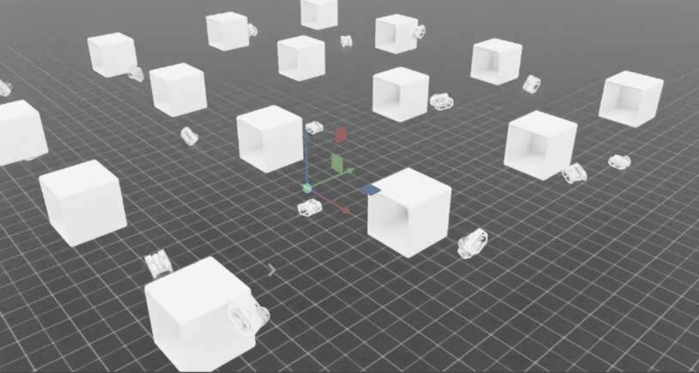

# Learning-Based AUV Docking

This repository contains the code for our project on developing robust autonomous underwater vehicle (AUV) docking policies that maintain performance despite unseen, unpredictable dynamics, using deep reinforcement learning with domain randomization and history-conditioned policies in NVIDIA Isaac Simulator. Find the full report [here](readme_assets/report.pdf).

<div align="center">
  
  
  <em>AUVs training in parallel in NVIDIA IsaacLab</em>
</div>

## Motivation

Autonomous docking is critical for long-term AUV missions, enabling data transmission, battery charging, and recovery. However, autonomous docking for underwater vehicles presents unique challenges due to:
- Complex, varying hydrodynamics and environmental forces
- Limited visibility and sensing capabilities underwater
- The high cost and risk of real-world testing

Our approach leverages simulation-based reinforcement learning to develop policies that generalize to out-of-distribution (OOD) vehicle dynamics - a critical capability for real-world deployment.

## Simulation Environment

Our simulation environment extends the AUV simulator built on NVIDIA's Isaac Labs framework. The physics model includes:

- PhysX for non-hydrodynamic physics and collisions
- MuJoCo-based hydrodynamic model for drag and buoyant forces
- Zero-order thruster dynamics

## Policy Architectures and Training

We train our models using Proximal Policy Optimization (PPO) and domain randomization to improve generalization to OOD hydrodynamics. We implement and evaluate four distinct policy architectures for AUV docking tasks:

### 1. Naive Position-Orientation-Reward Policy
- Baseline approach trained on fixed dynamics
- Observation consists of only the latest state

### 2. Small Domain-Randomized Policy
- Trained with systematic randomization of mass between episodes
- Maintains standard observation structure without historical information

### 3. Large Domain-Randomized Policy
- Similar to the small domain-randomized policy
- Samples from a wider band of physical parameters

### 4. Domain-Randomized History-Based Policy
- Most comprehensive approach
- Incorporates both domain randomization during training and temporal information
- Observation space includes concatenated history of previous states and actions:
  - `𝒪ₜ = {sₜ₋ₕ, aₜ₋ₕ, ..., sₜ, aₜ}`
- Uses history length `h=3` based on preliminary experiments

## Reward Function

$$R(s_t, a_t) = λ_1 * R_{dist} + λ_2 * R_{orient}$$

Where:

$R_{dist} = \text{exp}(-||p_t - p_{dock}||)$ rewards proximity to docking station

$R_{orient} = exp(-||θ_t - θ_{dock}||)$ rewards correct orientation

## Evaluation Protocol

We evaluated all policies under four conditions:
1. **In-Distribution**: Mass = 11.5 kg
2. **Edge-of-Distribution**: Mass = 13 kg
3. **Out-of-Distribution**: Mass = 16.5 kg
4. **Extreme Out-of-Distribution**: Mass = 21.5 kg

### Performance Metrics
- **Success Rate**: Percentage of successful docking attempts
- **Time to Dock**: Average time to complete successful docking
- **Distance Traveled**: Total path length during docking
- **Energy Efficiency**: Cumulative thruster usage
- **Motion Smoothness**: Measured by cumulative jerk

## Key Findings

- **Naive Policy**: Excels in standard and moderately increased mass conditions, proving simple control mechanisms work well in typical scenarios. Performance deteriorates significantly under extreme mass adjustments, revealing clear limitations in highly variable environments. This suggests the naive approach is optimal for predictable conditions but inadequate for extreme variations.

- **Domain Randomization Policies**: Generally underperform compared to the Naive Policy in standard conditions, but show improved resilience in out-of-distribution scenarios. Large DR configurations demonstrate better generalization capabilities with no meaningful increase in convergence time. This indicates DR is valuable primarily for systems that must operate in unpredictable environments.

- **Historical Data Integration**: Incorporating historical data did not consistently improve performance and occasionally diminished it, suggesting real-time state information may be sufficient. The DR with History policy, however, showed superior performance under high mass adjustment conditions. This indicates historical data can enhance robustness specifically in extreme scenarios, though alternative integration methods may need exploration.

Figures can be found in our full report [here](readme_assets/report.pdf)

## Future Directions

- Optimizing the domain randomization approach to balance performance in both ID and OOD conditions
- Extending to real-world testing and validation
- Exploring additional parameters beyond mass for domain randomization

## Installation

- Install IsaacSim (https://docs.omniverse.nvidia.com/isaacsim/latest/installation/install_workstation.html)
- Install IsaacLab (https://isaac-sim.github.io/IsaacLab/source/setup/installation/index.html)

- Clone this repository:

  - If using docker container:
  ```
  cd <IsaacLab_Path>/source/extensions/omni.isaac.lab_tasks/omni/isaac/lab_tasks/direct/learning-based-docking
  git clone git@gitlab.com:npragin/learning-based-docking.git
  ```

  - If using workstation install:
  ```
  git clone git@gitlab.com:npragin/learning-based-docking.git
  ln -s learning-based-control <IsaacLab_Path>/source/extensions/omni.isaac.lab_tasks/omni/isaac/lab_tasks/direct/learning-based-docking
  ```
  (Note: if using a workstation install, you can follow the docker instructions as well, but the soft link seems cleaner for local development. Docker is painful when working with links)

## Usage

```
./isaaclab.sh -p -m wandb login <wandb_api_key>
WANDB_USERNAME=<wandb_username> ./isaaclab.sh -p source/standalone/workflows/rsl_rl/train.py --task Isaac-BlueROV2-Direct-v1 --num_envs 1 --log_project_name <wandb_project_name> --logger wand
```

### Additional Notes:

 - To import a URDF file into USD format for IsaacLab, you can first export a ROS xacro file into URDF, and then import that URDF file into the IsaacSim URDFImporter Workflow.

 ```
 rosrun xacro xacro --inorder -o <output.urdf> <input.xacro>
 ./isaaclab.sh -p source/standalone/tools/convert_urdf.py  <input_urdf> <output_usd> --merge-joints --make-instance
 ```
